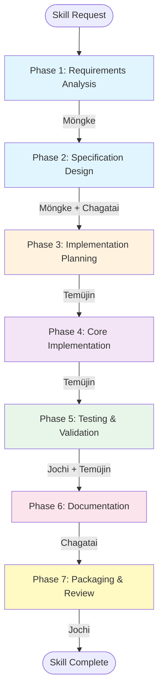
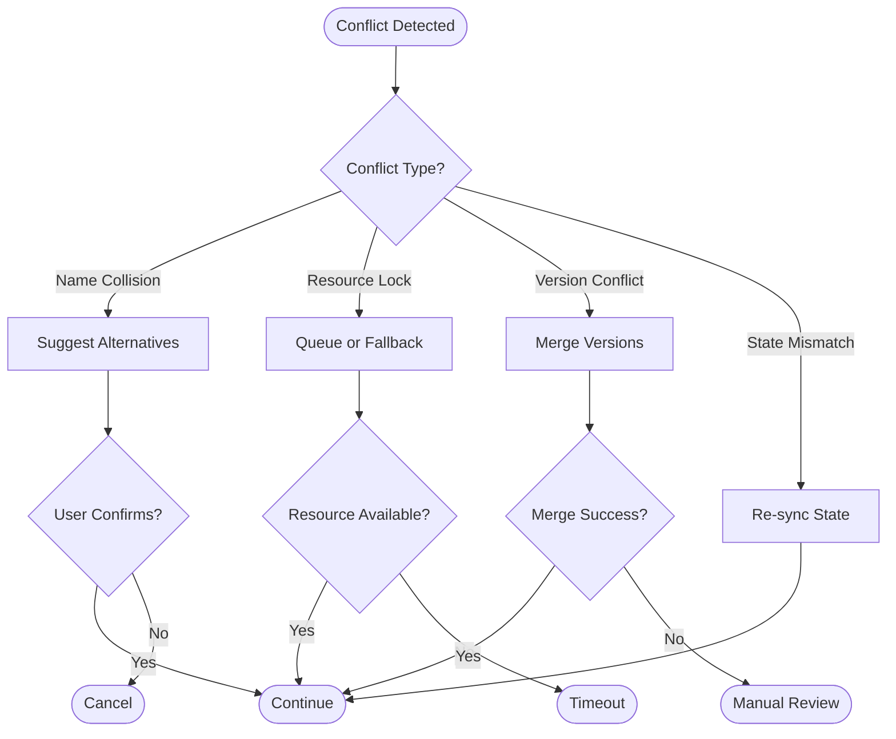

# Supercharged Skill Creator

**Version:** 1.0
**Status:** Production Ready
**Workflow:** 7-Phase Multi-Agent Skill Creation

---

## Quick Start

### Create Your First Skill in 3 Steps

```bash
# 1. Initiate skill creation
curl -X POST https://your-domain.com/api/skills/create \
  -H "Content-Type: application/json" \
  -d '{
    "name": "weather-finder",
    "description": "A skill that fetches weather data for any location",
    "priority": "normal",
    "requirements": {
      "language": "python",
      "features": ["async", "caching"]
    }
  }'

# 2. Monitor progress
curl https://your-domain.com/api/skills/{skill_id}

# 3. Download when ready
curl -O https://your-domain.com/api/skills/{skill_id}/package
```

**Expected Timeline:**
- Simple skills: 15-30 minutes
- Complex skills: 45-90 minutes
- Multi-tool skills: 2-4 hours

### Example Skill Created by This System

```python
# Generated skill: weather-finder
"""
Weather Finder Skill

Fetches current weather and forecasts for any location worldwide.
Supports caching, async operations, and multiple data sources.
"""

from typing import Optional
import aiohttp
from datetime import datetime

class WeatherFinder:
    """Find weather data for any location."""

    def __init__(self, api_key: Optional[str] = None):
        self.api_key = api_key
        self.cache = {}

    async def get_weather(self, location: str) -> dict:
        """Get current weather for location."""
        if location in self.cache:
            return self.cache[location]

        # Implementation generated by Temüjin (developer agent)
        async with aiohttp.ClientSession() as session:
            url = f"https://api.weather.org/v1/current?q={location}"
            async with session.get(url) as resp:
                data = await resp.json()
                self.cache[location] = data
                return data
```

---

## When to Use This Skill

### Ideal Use Cases

| Scenario | Use This Skill | Reason |
|----------|----------------|--------|
| Creating new agent capabilities | Yes | Full 7-phase workflow ensures quality |
| Wrapping existing APIs | Yes | Quick specification to implementation |
| Building data processing tools | Yes | Specialist agents handle edge cases |
| Simple one-off scripts | No | Overhead not justified |
| UI/only components | No | Not designed for frontend code |
| Critical production systems | With Caution | Requires additional validation |

### Skill Complexity Assessment

**Simple** (15-30 min)
- Single API wrapper
- Straightforward data transformation
- No external dependencies beyond requests/asyncio

**Moderate** (45-90 min)
- Multiple API integrations
- Error handling and retries
- Caching layer
- Configuration management

**Complex** (2-4 hours)
- Multi-tool orchestration
- Custom business logic
- Database integration
- Advanced error scenarios

---

## Pre-Flight Confirmation Template

Before creating a skill, the system presents a confirmation prompt based on assessed risk:

### Risk Assessment Matrix

| Factor | Low Risk | Medium Risk | High Risk |
|--------|----------|-------------|-----------|
| Data Access | Read-only APIs | External services | Database writes |
| Scope | Single function | Multiple files | Package with deps |
| Side Effects | None | Creates files | System changes |
| Reversibility | Fully reversible | Can be undone | Destructive |

### Confirmation Prompt Example

```
[⚠⚠] Operation: Create Skill "weather-finder"

Description: Generate a complete, production-ready skill for fetching weather data
from external APIs with caching and error handling.

Details:
  Category: WRITE
  Risk Level: MEDIUM
  Affected Resources:
    - /tmp/skills/weather-finder/
    - https://api.weather.org/
  Estimated Duration: 45 minutes
  Reversible: Yes (files can be deleted)
  Potential Side Effects:
    - Creates new skill package
    - Makes test API calls during validation
    - Registers in skill catalog

Type 'yes' to confirm or 'no' to cancel.
```

### Auto-Approved Operations

The following operations bypass confirmation:
- Dry-run skill planning (`--dry-run` flag)
- Skill specification preview
- Agent availability checks
- Dependency analysis only

---

## OpenClaw Agent Mappings

### Agent Overview

| Agent ID | Name | Specialty | Skill Creation Role |
|----------|------|-----------|---------------------|
| `main` | Kublai | Orchestration | Workflow coordinator, final synthesis |
| `researcher` | Möngke | Research | Requirements, dependencies, discovery |
| `writer` | Chagatai | Documentation | Specs, READMEs, examples |
| `developer` | Temüjin | Development | Implementation, testing, packaging |
| `analyst` | Jochi | Validation | Quality gates, test design |
| `ops` | Ögedei | Operations | Deployment configuration |

### Phase-to-Agent Mapping



### Agent Capabilities Matrix

| Capability | Kublai | Möngke | Chagatai | Temüjin | Jochi | Ögedei |
|------------|--------|--------|----------|---------|-------|--------|
| Requirements Gathering | Basic | **Expert** | Basic | Basic | Basic | None |
| Specification Writing | Good | **Expert** | **Expert** | Good | Good | None |
| Code Implementation | Good | None | None | **Expert** | Good | Basic |
| Test Design | Basic | None | None | **Expert** | **Expert** | None |
| Documentation | Good | Basic | **Expert** | Basic | Good | None |
| Validation | Basic | None | None | Good | **Expert** | None |
| Package Management | None | None | None | Good | Good | **Expert** |

---

## 7-Phase Workflow Documentation

### Phase 1: Requirements Analysis

**Agent:** Möngke (researcher)
**Duration:** 5-10 minutes
**Gate:** Feasibility Gate

**Activities:**
- Parse user requirements into structured format
- Research existing skills in registry
- Identify dependencies and potential conflicts
- Document user stories and acceptance criteria

**Output:**
```cypher
(:Research {
  skill_id: "uuid",
  topic: "weather-finder requirements",
  findings: "Requirements analysis complete",
  similar_skills: ["location-lookup", "api-wrapper"],
  dependencies: ["aiohttp", "python-dateutil"],
  conflicts: [],
  user_stories: [
    "As a user, I want to get current weather for any city",
    "As a user, I want cached results for recent queries"
  ]
})
```

**Validation Criteria:**
- Requirements are unambiguous
- Dependencies are available
- No naming conflicts with existing skills
- Feasibility confirmed

**Error Handling:**
- If requirements ambiguous → Request clarification
- If conflicts found → Suggest alternative names
- If dependencies unavailable → Flag for manual review

---

### Phase 2: Specification Design

**Agents:** Möngke (researcher) + Chagatai (writer)
**Duration:** 5-15 minutes
**Gate:** Completeness Gate

**Activities:**
- Design skill interface (input/output contracts)
- Define parameter schemas with JSON Schema
- Create validation rules
- Write human-readable specification

**Output:**
```cypher
(:Specification {
  skill_id: "uuid",
  name: "weather-finder",
  description: "Fetches weather data for any location",
  input_schema: {
    "type": "object",
    "properties": {
      "location": {"type": "string"},
      "units": {"enum": ["celsius", "fahrenheit"]}
    },
    "required": ["location"]
  },
  output_schema: {
    "type": "object",
    "properties": {
      "temperature": {"type": "number"},
      "conditions": {"type": "string"},
      "timestamp": {"type": "string", "format": "date-time"}
    }
  },
  parameters: {...},
  validation_rules: [...]
})
```

**Validation Criteria:**
- Input schema validates all edge cases
- Output schema matches expected structure
- Validation rules are complete
- Specification is human-readable

**Error Handling:**
- If schema invalid → Return to Phase 1
- If validation incomplete → Request additional rules

---

### Phase 3: Implementation Planning

**Agent:** Temüjin (developer)
**Duration:** 5-10 minutes
**Gate:** Robustness Gate

**Activities:**
- Design implementation architecture
- Plan file structure
- Identify required libraries
- Create implementation checklist

**Output:**
```cypher
(:ImplementationPlan {
  skill_id: "uuid",
  architecture: "Single-class async implementation",
  file_structure: [
    "weather_finder/__init__.py",
    "weather_finder/client.py",
    "weather_finder/cache.py",
    "weather_finder/exceptions.py"
  ],
  dependencies: [
    {"name": "aiohttp", "version": ">=3.8.0"},
    {"name": "cachetools", "version": ">=5.0.0"}
  ],
  checklist: [
    "Implement async client",
    "Add TTL cache",
    "Create custom exceptions",
    "Add retry logic"
  ]
})
```

**Validation Criteria:**
- Architecture is appropriate for requirements
- All dependencies are available
- File structure follows conventions
- Checklist is complete

**Error Handling:**
- If architecture unsuitable → Revise specification
- If dependencies conflict → Find alternatives

---

### Phase 4: Core Implementation

**Agent:** Temüjin (developer)
**Duration:** 10-30 minutes
**Gate:** Viability Gate

**Activities:**
- Write skill implementation code
- Implement validation logic
- Handle edge cases and errors
- Add inline documentation

**Output:**
```cypher
(:CodeArtifact {
  skill_id: "uuid",
  file_path: "weather_finder/client.py",
  language: "python",
  content: "<generated code>",
  hash: "sha256:..."
})
```

**Validation Criteria:**
- Code passes linting
- Type hints are present
- Error handling is comprehensive
- Docstrings are complete

**Error Handling:**
- If linting fails → Fix and retry
- If type errors → Add proper annotations
- If timeout → Split into smaller tasks

---

### Phase 5: Testing & Validation

**Agents:** Jochi (analyst) + Temüjin (developer)
**Duration:** 5-15 minutes
**Gate:** Spec Complete Gate

**Activities:**
- Design test cases and scenarios
- Implement automated tests
- Run validation against quality gates
- Performance assessment

**Output:**
```cypher
(:TestSuite {
  skill_id: "uuid",
  test_cases: [
    {
      "name": "test_get_weather_success",
      "input": {"location": "London"},
      "expected": {"temperature": 15, "conditions": "Cloudy"}
    },
    {
      "name": "test_get_weather_invalid_location",
      "input": {"location": ""},
      "expected_error": "InvalidLocationError"
    }
  ],
  coverage: 0.95,
  results: {...},
  passed: 12,
  failed: 0
})

(:ValidationResult {
  skill_id: "uuid",
  quality_score: 0.92,
  performance_score: 0.88,
  security_score: 0.95,
  passed: true
})
```

**Validation Criteria:**
- All tests pass
- Code coverage >= 80%
- Quality score >= 0.8
- No security vulnerabilities

**Error Handling:**
- If tests fail → Return to Phase 4
- If coverage low → Add more tests
- If security issues → Fix vulnerabilities

---

### Phase 6: Documentation

**Agent:** Chagatai (writer)
**Duration:** 5-10 minutes
**Gate:** Documentation Gate

**Activities:**
- Write user-facing README
- Create usage examples
- Document API surface
- Generate installation guide

**Output:**
```cypher
(:Documentation {
  skill_id: "uuid",
  type: "readme",
  content: "# Weather Finder\\n\\n...",
  format: "markdown"
})
```

**README Template:**
```markdown
# {Skill Name}

{Brief description}

## Installation

```bash
pip install {skill-name}
```

## Usage

```python
from {skill_name} import {MainClass}

{usage_example}
```

## API Reference

| Parameter | Type | Required | Description |
|-----------|------|----------|-------------|
{api_table}

## Examples

{example_code}

## License

MIT
```

**Validation Criteria:**
- README follows template
- Examples are runnable
- API documentation is complete
- Installation instructions work

**Error Handling:**
- If examples invalid → Fix code or docs
- If installation fails → Fix dependencies

---

### Phase 7: Packaging & Review

**Agent:** Jochi (analyst)
**Duration:** 5-10 minutes
**Gate:** Deploy Ready Gate

**Activities:**
- Final quality review
- Package skill for distribution
- Create installation manifest
- Register in skill catalog

**Output:**
```cypher
(:SkillPackage {
  skill_id: "uuid",
  name: "weather-finder",
  version: "1.0.0",
  package_url: "https://cdn.example.com/skills/weather-finder-1.0.0.tar.gz",
  checksum: "sha256:...",
  manifest: {
    "files": ["weather_finder/..."],
    "dependencies": ["aiohttp>=3.8.0"],
    "entry_point": "weather_finder:WeatherFinder"
  },
  status: "published"
})
```

**Final Quality Checklist:**
- [ ] All phases completed successfully
- [ ] Code review passed
- [ ] All tests passing
- [ ] Documentation complete
- [ ] Package integrity verified
- [ ] No security issues
- [ ] Performance acceptable

**Error Handling:**
- If review fails → Return to relevant phase
- If package invalid → Rebuild
- If registration fails → Retry with backoff

---

## Time Estimation Guide

### Base Times by Phase

| Phase | Simple | Moderate | Complex |
|-------|--------|----------|---------|
| Requirements Analysis | 3-5 min | 5-10 min | 10-20 min |
| Specification Design | 3-5 min | 5-15 min | 15-30 min |
| Implementation Planning | 3-5 min | 5-10 min | 10-20 min |
| Core Implementation | 5-10 min | 10-30 min | 30-60 min |
| Testing & Validation | 3-5 min | 5-15 min | 15-30 min |
| Documentation | 3-5 min | 5-10 min | 10-20 min |
| Packaging & Review | 3-5 min | 5-10 min | 10-15 min |
| **Total** | **23-40 min** | **40-100 min** | **90-195 min** |

### Complexity Multipliers

Apply these multipliers to base time:

| Factor | Multiplier | Example |
|--------|------------|---------|
| Async operations | 1.2x | aiohttp, asyncio |
| Multiple APIs | 1.3x | 2+ external services |
| Database access | 1.4x | SQL, Neo4j, etc. |
| Custom algorithms | 1.5x | Data processing |
| File I/O | 1.1x | Reading/writing files |

### Calculation Example

```
Base: Moderate skill (70 minutes)
Multipliers:
  - Async: 1.2x
  - Multiple APIs: 1.3x

Estimated Time: 70 * 1.2 * 1.3 = 109 minutes
```

---

## Error Handling

### Error Categories

| Category | Handling Strategy | Example |
|----------|-------------------|---------|
| **Transient** | Retry with exponential backoff | Network timeout, API rate limit |
| **Agent Unavailable** | Fallback to alternative agent | Möngke down → Use Kublai |
| **Validation Failure** | Return to previous phase | Test failure → Fix code |
| **Conflict** | Resolution strategy applied | Name collision → Suggest alt |
| **Critical** | Manual intervention required | System-wide failure |

### Retry Configuration

```python
RETRY_CONFIG = {
    "transient": {
        "max_retries": 3,
        "base_delay": 1.0,
        "max_delay": 30.0,
        "backoff_multiplier": 2.0
    },
    "agent_unavailable": {
        "max_retries": 5,
        "base_delay": 5.0,
        "max_delay": 300.0,
        "backoff_multiplier": 1.5
    },
    "validation_failure": {
        "max_retries": 1,
        "requires_manual_intervention": True
    }
}
```

### Common Error Scenarios

#### Scenario 1: Agent Unavailable

```
ERROR: Agent 'researcher' (Möngke) is not responding
ACTION: Falling back to 'main' (Kublai) for research phase
NOTIFICATION: Degraded mode active - research quality may be reduced
```

#### Scenario 2: Dependency Conflict

```
ERROR: Dependency 'broken-lib>=2.0.0' not found in registry
ACTION: Suggesting alternative 'stable-lib>=1.5.0'
CONFIRMATION: Type 'yes' to use alternative or 'no' to cancel
```

#### Scenario 3: Validation Failure

```
ERROR: Phase 5 (Testing) validation failed
REASON: 3 tests failed, 78% coverage (require 80%)
ACTION: Returning to Phase 4 (Implementation) for fixes
NEXT: Will retry testing after fixes applied
```

#### Scenario 4: Timeout

```
ERROR: Phase 4 (Implementation) exceeded 30-minute timeout
ACTION: Creating checkpoint, will resume from partial state
NOTIFICATION: Progress saved, can be continued with --resume flag
```

---

## Conflict Resolution Protocol

### Conflict Types

| Type | Detection | Resolution |
|------|-----------|------------|
| **Name Collision** | Skill name exists | Suggest alternatives |
| **Version Conflict** | Dep version incompatible | Find compatible version |
| **Resource Lock** | Agent busy | Queue or fallback |
| **State Mismatch** | Expected != Actual | Re-sync state |

### Resolution Strategies

```
1. RETRY: Wait and retry with exponential backoff
2. OVERWRITE: Force operation (requires confirmation)
3. MERGE: Intelligently combine conflicting changes
4. SKIP: Skip operation, keep existing
5. FAIL: Raise exception, halt workflow
6. FALLBACK: Execute alternative operation
```

### Conflict Resolution Flow



### Example: Name Conflict Resolution

```
CONFLICT: Skill name 'weather-finder' already exists
OPTIONS:
  1. weather-finder-v2
  2. wx-finder
  3. weather-lookup
  4. Custom: ____

Enter choice (1-4) or type custom name:
```

---

## Exit Conditions

### Successful Completion

**Conditions:**
- All 7 phases completed
- All validation gates passed
- Package generated and verified
- Skill registered in catalog

**Output:**
```json
{
  "skill_id": "uuid",
  "name": "weather-finder",
  "version": "1.0.0",
  "status": "published",
  "package_url": "https://...",
  "checksum": "sha256:...",
  "completion_time": "2026-02-04T15:30:00Z",
  "total_duration": "47 minutes",
  "quality_score": 0.92
}
```

### Graceful Exit

**Conditions:**
- User cancellation
- Unrecoverable error after retries
- Timeout exceeded
- Manual intervention required

**Output:**
```json
{
  "skill_id": "uuid",
  "status": "halted",
  "phase": 4,
  "reason": "User cancelled",
  "checkpoint_available": true,
  "can_resume": true
}
```

### Failure Exit

**Conditions:**
- Critical system failure
- All fallbacks exhausted
- Security violation detected

**Output:**
```json
{
  "skill_id": "uuid",
  "status": "failed",
  "phase": 3,
  "error": "Dependency not found: critical-lib",
  "retry_possible": false,
  "requires_manual_intervention": true
}
```

---

## Invocation Methods: Skill vs Task

### When to Use Skills

**Skills** are invoked via the `Skill()` tool and represent workflow capabilities or expert domains:

```python
# Invoke a skill directly
Skill("senior-backend", "Review this API design for security and performance")
Skill("code-reviewer", "Review the changes in this pull request")
Skill("horde-plan", "Create an implementation plan for user authentication")
```

**Use `Skill()` when:**
- You need domain expertise (backend, frontend, DevOps, data, etc.)
- You're executing a predefined workflow (planning, reviewing, testing)
- You want to leverage a specialist's complete workflow
- The capability is a "skill" in the available skills list

### When to Use Task with Subagent Types

**Task with `subagent_type`** dispatches specialized agent implementations for parallel execution:

```python
# Dispatch a subagent with specific type
Task(
    subagent_type="backend-development:backend-architect",
    prompt="Design the database schema for this feature"
)
```

**Use `Task(subagent_type=...)` when:**
- You're implementing a multi-phase plan with independent tasks
- You need parallel execution via subagent-driven-development
- You're working within the `subagent-driven-development` workflow
- You need fine-grained task dispatch with verification gates

### Key Differences

| Aspect | Skill() | Task(subagent_type=) |
|--------|---------|----------------------|
| **Purpose** | Workflow/domain expertise | Task execution |
| **Invocation** | `Skill("name", "prompt")` | `Task(subagent_type="domain:agent", ...)` |
| **Used by** | Direct invocation | subagent-driven-development |
| **Examples** | `senior-backend`, `code-reviewer`, `horde-plan` | `backend-development:backend-architect`, `frontend-mobile-development:frontend-developer` |
| **Execution** | Sequential, single skill | Parallel, swarm of subagents |

### Mapping Table

| Domain | Skill Name | Subagent Type |
|--------|-----------|---------------|
| Backend | `senior-backend` | `backend-development:backend-architect` |
| Frontend | `senior-frontend` | `frontend-mobile-development:frontend-developer` |
| DevOps | `senior-devops` | (uses skill directly) |
| Data Engineering | `senior-data-engineer` | (uses skill directly) |
| Code Review | `code-reviewer` | (uses skill directly) |

---

## Integration Points

### Delegation Protocol

The skill creator integrates with OpenClaw's `DelegationProtocol`:

```python
from tools.delegation_protocol import DelegationProtocol

protocol = DelegationProtocol(
    memory=operational_memory,
    gateway_url=os.getenv("GATEWAY_URL"),
    gateway_token=os.getenv("GATEWAY_TOKEN")
)

# Delegate to Möngke for Phase 1
result = protocol.delegate_task(
    task_description="Research requirements for weather-finder skill",
    context={
        "topic": "weather-finder",
        "skill_type": "api-wrapper",
        "workflow": "skill_creation",
        "phase": "requirements"
    },
    suggested_agent="researcher",
    priority="high"
)
```

### Task Routing

```python
SKILL_CREATION_ROUTING = {
    # Phase 1 - Research
    "research": "researcher",
    "analyze": "analyst",
    "discover": "researcher",

    # Phase 2 - Specification
    "specify": "researcher",
    "design": "researcher",
    "document": "writer",

    # Phase 3-4 - Implementation
    "plan": "developer",
    "implement": "developer",
    "code": "developer",

    # Phase 5 - Testing
    "test": "analyst",
    "validate": "analyst",
    "verify": "analyst",

    # Phase 6 - Documentation
    "write": "writer",
    "readme": "writer",

    # Phase 7 - Packaging
    "package": "analyst",
    "publish": "analyst",
}
```

### Webhook Events

**Base URL:** `https://your-domain.com/api/webhook`

| Event | When Fired | Payload |
|-------|------------|---------|
| `phase_started` | Phase begins | `phase_id`, `agent`, `skill_id` |
| `phase_completed` | Phase succeeds | `phase_id`, `result`, `skill_id` |
| `phase_failed` | Phase fails | `phase_id`, `error`, `skill_id` |
| `validation_required` | Manual input needed | `phase_id`, `validation_data` |
| `skill_ready` | Skill complete | `skill_id`, `package_url` |

### Neo4j State Management

All workflow state is persisted in Neo4j:

```cypher
// Track skill creation progress
MATCH (s:SkillRequest {id: $skill_id})
MATCH (s)-[:HAS_PHASE]->(p:SkillPhase)
RETURN p.phase_number, p.phase_name, p.status, p.assigned_to
ORDER BY p.phase_number

// Get current phase for an agent
MATCH (p:SkillPhase {assigned_to: $agent_id, status: 'in_progress'})
RETURN p

// Create output node from phase
CREATE (c:CodeArtifact {
  skill_id: $skill_id,
  phase_id: $phase_id,
  file_path: $file_path,
  content: $content,
  created_at: datetime()
})
```

---

## Troubleshooting

### Common Issues and Solutions

#### Issue: Workflow Stuck in Phase

**Symptoms:**
- Phase shows `in_progress` for >30 minutes
- No webhook updates received

**Diagnosis:**
```bash
# Check agent status
curl https://your-domain.com/api/agents/status

# Check phase state
curl https://your-domain.com/api/skills/{skill_id}

# View recent logs
curl https://your-domain.com/api/logs?skill_id={skill_id}
```

**Solutions:**
1. If agent offline → System auto-falls back
2. If timeout exceeded → Workflow resumes from checkpoint
3. If state corrupted → Manual state reset required

#### Issue: Validation Gate Failure

**Symptoms:**
- Phase returns `validation_failed` status
- Quality score below threshold

**Diagnosis:**
```bash
# Get validation details
curl https://your-domain.com/api/skills/{skill_id}/validation

# View test results
curl https://your-domain.com/api/skills/{skill_id}/tests
```

**Solutions:**
1. Review failed criteria in validation report
2. Workflow auto-returns to previous phase
3. Manual intervention possible if auto-fix fails

#### Issue: Agent Circuit Breaker Open

**Symptoms:**
- `CircuitBreakerOpen` error
- Agent requests rejected

**Diagnosis:**
```bash
# Check circuit breaker state
curl https://your-domain.com/api/circuit-breakers

# View failure history
curl https://your-domain.com/api/circuit-breakers/{agent_name}/history
```

**Solutions:**
1. Wait for timeout (default 60 seconds)
2. Manual reset via API:
   ```bash
   curl -X POST https://your-domain.com/api/circuit-breakers/{name}/reset
   ```
3. Use fallback agent automatically

#### Issue: Package Installation Failure

**Symptoms:**
- Generated skill fails to install
- Dependency errors

**Diagnosis:**
```bash
# Test package locally
pip install --dry-run ./skill-package.tar.gz

# Check dependencies
pip install --no-deps ./skill-package.tar.gz
```

**Solutions:**
1. Report bug for regeneration
2. Manual dependency fix possible
3. Fallback to source installation

### Debug Mode

Enable debug logging for detailed troubleshooting:

```bash
# Via API
curl -X POST https://your-domain.com/api/skills/create \
  -d '{"name": "test", "debug": true}'

# Via environment variable
export SKILL_CREATOR_DEBUG=1
```

Debug output includes:
- Full agent communication logs
- State transition history
- Validation gate details
- Performance metrics

### Recovery from Failures

**Resume from checkpoint:**
```bash
curl -X POST https://your-domain.com/api/skills/{skill_id}/resume
```

**Force reset phase:**
```bash
curl -X POST https://your-domain.com/api/skills/{skill_id}/reset \
  -d '{"phase": 4}'
```

**Retry with different agent:**
```bash
curl -X POST https://your-domain.com/api/skills/{skill_id}/retry \
  -d '{"phase": 4, "agent": "main"}'
```

---

## API Reference

### REST Endpoints

#### Create Skill Request

```
POST /api/skills/create

Request Body:
{
  "name": string,              // Required: Skill name
  "description": string,       // Required: Skill description
  "priority": "low" | "normal" | "high",  // Optional
  "requirements": {
    "language": string,        // Optional: python, javascript
    "features": string[],      // Optional: async, caching, etc.
    "timeout": number          // Optional: max minutes
  },
  "dry_run": boolean           // Optional: plan only
}

Response: 202 Accepted
{
  "skill_id": "uuid",
  "status": "pending",
  "current_phase": "requirements",
  "estimated_completion": "ISO-8601 timestamp"
}
```

#### Get Skill Status

```
GET /api/skills/{skill_id}

Response: 200 OK
{
  "skill_id": "uuid",
  "name": string,
  "status": "pending" | "in_progress" | "completed" | "failed",
  "current_phase": string,
  "phases": [
    {
      "phase": string,
      "status": string,
      "assigned_to": string,
      "started_at": "ISO-8601",
      "completed_at": "ISO-8601" | null
    }
  ],
  "progress": 0.0-1.0
}
```

#### Download Skill Package

```
GET /api/skills/{skill_id}/package

Response: 200 OK
Content-Type: application/gzip
Content-Disposition: attachment; filename="{name}-{version}.tar.gz"

<binary package data>
```

#### List Active Skills

```
GET /api/skills?status=in_progress&agent=researcher

Response: 200 OK
{
  "skills": [...],
  "count": number
}
```

### Webhook Format

```typescript
interface SkillCreationWebhook {
  source: 'kublai' | 'researcher' | 'writer' | 'developer' | 'analyst' | 'ops';
  agentId?: string;
  eventType: 'phase_started' | 'phase_completed' | 'phase_failed' |
              'validation_required' | 'skill_ready';
  data: {
    skill_id: string;
    phase: string;
    phase_number: number;
    status: string;
    result?: {
      phase_id: string;
      output_node_ids: string[];
      metrics: Record<string, number>;
    };
    error?: {
      message: string;
      retryable: boolean;
      retry_after?: number;
    };
    validation_request?: {
      criteria: string[];
      current_output: any;
      approvers: string[];
    };
    timestamp: string;
  };
}
```

---

## Examples

### Example 1: Simple API Wrapper

**Request:**
```json
{
  "name": "joke-finder",
  "description": "Fetch random jokes from the official-joke-api",
  "priority": "normal"
}
```

**Generated Skill Structure:**
```
joke-finder/
├── README.md
├── setup.py
├── joke_finder/
│   ├── __init__.py
│   ├── client.py          # API client
│   └── models.py          # Data models
└── tests/
    └── test_client.py
```

**Usage:**
```python
from joke_finder import JokeFinder

finder = JokeFinder()
joke = await finder.get_random_joke()
print(joke.setup, joke.punchline)
```

### Example 2: Async Multi-API Skill

**Request:**
```json
{
  "name": "location-enhancer",
  "description": "Enrich location data with timezone, weather, and timezone info",
  "priority": "high",
  "requirements": {
    "language": "python",
    "features": ["async", "caching", "retry"]
  }
}
```

**Generated Skill Structure:**
```
location-enhancer/
├── README.md
├── setup.py
├── location_enhancer/
│   ├── __init__.py
│   ├── client.py           # Multi-API client
│   ├── cache.py            # TTL cache
│   ├── retry.py            # Retry logic
│   └── models.py           # Pydantic models
└── tests/
    ├── test_client.py
    └── test_cache.py
```

**Usage:**
```python
from location_enhancer import LocationEnhancer

enhancer = LocationEnhancer(cache_ttl=3600)
data = await enhancer.enrich("San Francisco, CA")
# Returns: {location, timezone, weather, coordinates, ...}
```

### Example 3: Data Processing Skill

**Request:**
```json
{
  "name": "data-normalizer",
  "description": "Normalize and clean messy dataset records",
  "priority": "normal",
  "requirements": {
    "language": "python",
    "features": ["validation"]
  }
}
```

**Generated Skill Structure:**
```
data-normalizer/
├── README.md
├── setup.py
├── data_normalizer/
│   ├── __init__.py
│   ├── normalizer.py       # Core logic
│   ├── validators.py       # Input validation
│   ├── transformers.py     # Data transformations
│   └── schema.py           # JSON schemas
└── tests/
    ├── test_normalizer.py
    └── test_validators.py
```

**Usage:**
```python
from data_normalizer import DataNormalizer

normalizer = DataNormalizer()
clean = normalizer.normalize([
    {"name": "  john  ", "email": "JOHN@EXAMPLE.com"},
    {"name": "Jane", "email": "invalid"}
])
# Returns: Validated, cleaned records with error reporting
```

---

## Appendix

### Environment Variables

| Variable | Description | Default | Required |
|----------|-------------|---------|----------|
| `NEO4J_URI` | Neo4j connection URI | `bolt://localhost:7687` | No |
| `NEO4J_USER` | Neo4j username | `neo4j` | No |
| `NEO4J_PASSWORD` | Neo4j password | - | Yes |
| `GATEWAY_URL` | OpenClaw gateway URL | - | No |
| `GATEWAY_TOKEN` | Gateway auth token | - | No |
| `WEBHOOK_URL` | Webhook base URL | - | Yes |
| `SKILL_OUTPUT_DIR` | Output directory | `/tmp/skills` | No |
| `DEBUG` | Enable debug logging | `false` | No |

### Related Files

| File | Purpose |
|------|---------|
| `ARCHITECTURE.md` | Detailed system architecture |
| `tools/delegation_protocol.py` | Agent delegation protocol |
| `openclaw_memory.py` | Neo4j operational memory |
| `validators/preflight.py` | Pre-flight confirmation system |
| `validators/circuit_breaker.py` | Circuit breaker implementation |
| `validators/conflict_resolver.py` | Conflict resolution |
| `validators/degradation.py` | Graceful degradation |
| `validation_gates.py` | Phase validation gates |

### Version History

| Version | Date | Changes |
|---------|------|---------|
| 1.0.0 | 2026-02-04 | Initial release |

---

**Document Status:** Production Ready
**Author:** OpenClaw Architecture Team
**Last Updated:** 2026-02-04
