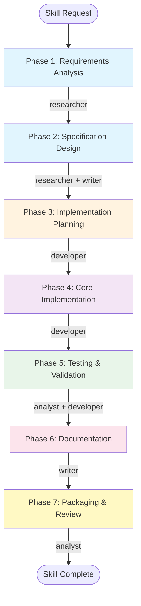
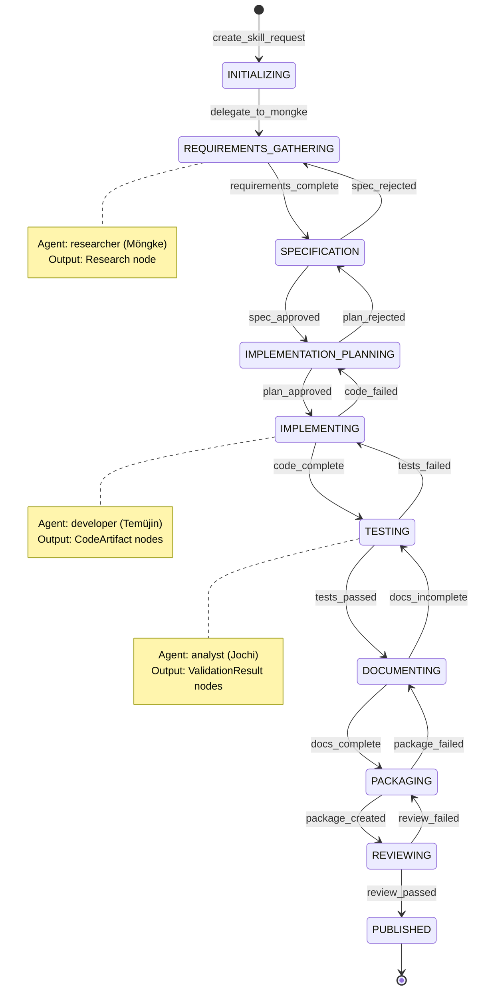
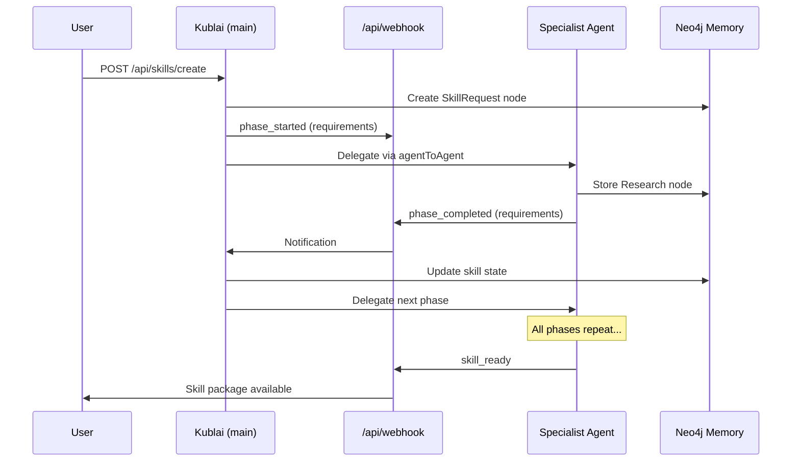
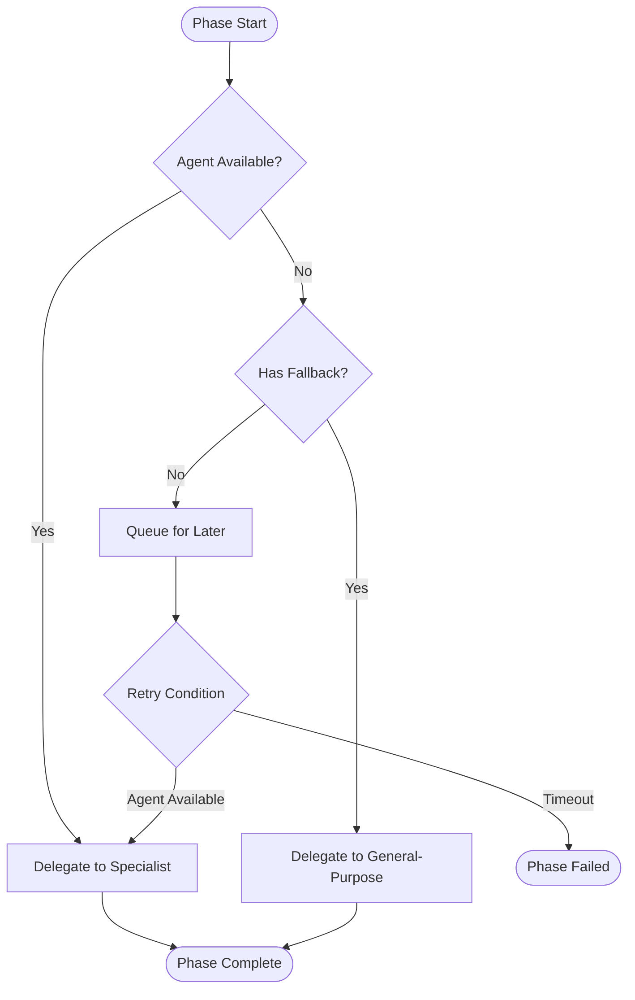

# Supercharged Skill Creator - OpenClaw Architecture

**Version:** 1.0
**Date:** 2026-02-04
**Status:** Design Document

---

## Executive Summary

The Supercharged Skill Creator is a multi-phase workflow system optimized for the OpenClaw multi-agent platform. It enables collaborative skill creation through specialized agent roles, Neo4j-backed state tracking, and webhook-based coordination.

### Key Design Principles
1. **Agent Specialization** - Each phase maps to the most capable OpenClaw agent
2. **State Persistence** - All workflow state tracked in Neo4j for resilience
3. **Async Coordination** - Webhook-based notification system for loose coupling
4. **Quality Gates** - Validation at each phase before progression
5. **Graceful Degradation** - Fallback to general-purpose when specialists unavailable

---

## Table of Contents

1. [OpenClaw Agent Role Mappings](#openclaw-agent-role-mappings)
2. [Workflow Architecture](#workflow-architecture)
3. [Delegation Protocol Integration](#delegation-protocol-integration)
4. [Webhook Coordination Patterns](#webhook-coordination-patterns)
5. [Neo4j Schema Design](#neo4j-schema-design)
6. [Fallback Strategy](#fallback-strategy)
7. [API Contracts](#api-contracts)
8. [Error Handling & Resilience](#error-handling--resilience)

---

## 1. OpenClaw Agent Role Mappings

### Agent Overview

| Agent ID | Name | Primary Role | Skill Creation Phases |
|----------|------|--------------|----------------------|
| `main` | Kublai | Coordinator | Orchestration, synthesis |
| `researcher` | Möngke | Research Specialist | Requirements research, dependency analysis |
| `writer` | Chagatai | Content Writer | Documentation generation |
| `developer` | Temüjin | Software Developer | Implementation, testing |
| `analyst` | Jochi | Data Analyst | Validation, quality assessment |
| `ops` | Ögedei | DevOps Engineer | Packaging, deployment |

### Phase-to-Agent Mapping



### Detailed Phase Responsibilities

#### Phase 1: Requirements Analysis (Möngke - Researcher)
- **Agent:** `researcher` (Möngke)
- **Responsibilities:**
  - Analyze skill requirements from user prompt
  - Research existing similar skills in registry
  - Identify dependencies and conflicts
  - Document user stories and acceptance criteria
- **Output:** `Research` node with findings

#### Phase 2: Specification Design (Möngke + Chagatai)
- **Primary Agent:** `researcher` (Möngke)
- **Support Agent:** `writer` (Chagatai)
- **Responsibilities:**
  - Design skill interface (input/output contracts)
  - Define parameter schemas and validation rules
  - Create human-readable specification
- **Output:** `Specification` node with full contract

#### Phase 3: Implementation Planning (Temüjin - Developer)
- **Agent:** `developer` (Temüjin)
- **Responsibilities:**
  - Design implementation architecture
  - Plan file structure and dependencies
  - Identify required libraries/frameworks
  - Create implementation checklist
- **Output:** `ImplementationPlan` node

#### Phase 4: Core Implementation (Temüjin - Developer)
- **Agent:** `developer` (Temüjin)
- **Responsibilities:**
  - Write skill implementation code
  - Implement validation logic
  - Handle edge cases and errors
  - Add inline documentation
- **Output:** `CodeArtifact` nodes

#### Phase 5: Testing & Validation (Jochi - Analyst + Temüjin)
- **Primary Agent:** `analyst` (Jochi)
- **Support Agent:** `developer` (Temüjin)
- **Responsibilities:**
  - Design test cases and scenarios
  - Implement automated tests
  - Run validation against quality gates
  - Performance and security assessment
- **Output:** `TestSuite` and `ValidationResult` nodes

#### Phase 6: Documentation (Chagatai - Writer)
- **Agent:** `writer` (Chagatai)
- **Responsibilities:**
  - Write user-facing documentation
  - Create usage examples
  - Document API surface
  - Generate README
- **Output:** `Documentation` node

#### Phase 7: Packaging & Review (Jochi - Analyst)
- **Agent:** `analyst` (Jochi)
- **Responsibilities:**
  - Final quality review
  - Package skill for distribution
  - Create installation manifest
  - Register in skill catalog
- **Output:** `SkillPackage` node

---

## 2. Workflow Architecture

### State Machine



### Workflow Orchestration

The workflow is orchestrated by **Kublai (main agent)** using the `DelegationProtocol`:

```python
# Pseudo-code for skill creation workflow
class SkillCreationWorkflow:
    def __init__(self, delegation_protocol: DelegationProtocol):
        self.protocol = delegation_protocol
        self.memory = delegation_protocol.memory

    async def create_skill(self, request: SkillRequest) -> SkillPackage:
        # Phase 1: Requirements (Möngke)
        research_result = await self.delegate_to_researcher(request)

        # Phase 2: Specification (Möngke + Chagatai)
        specification = await self.create_specification(research_result)

        # Phase 3: Planning (Temüjin)
        impl_plan = await self.delegate_to_developer(specification, phase="planning")

        # Phase 4: Implementation (Temüjin)
        code_artifacts = await self.delegate_to_developer(impl_plan, phase="implementation")

        # Phase 5: Testing (Jochi + Temüjin)
        test_results = await self.delegate_to_analyst(code_artifacts, phase="testing")

        # Phase 6: Documentation (Chagatai)
        documentation = await self.delegate_to_writer(test_results)

        # Phase 7: Packaging (Jochi)
        package = await self.delegate_to_analyst(documentation, phase="packaging")

        return package
```

---

## 3. Delegation Protocol Integration

### Invoking Agents via Delegation Protocol

The skill creator uses `DelegationProtocol` from `tools/delegation_protocol.py`:

#### Task Creation Pattern

```python
from tools.delegation_protocol import DelegationProtocol, TaskType

# Initialize protocol
protocol = DelegationProtocol(
    memory=operational_memory,
    gateway_url=os.getenv("GATEWAY_URL"),
    gateway_token=os.getenv("GATEWAY_TOKEN")
)

# Delegate to Möngke for research
result = protocol.delegate_task(
    task_description="Research existing skills similar to: {skill_name}",
    context={
        "topic": skill_name,
        "skill_type": skill_type,
        "workflow": "skill_creation",
        "phase": "requirements"
    },
    suggested_agent="researcher",  # Möngke
    priority="high"
)
```

#### Agent-Specific Convenience Functions

```python
# Research phase (Möngke)
from tools.delegation_protocol import delegate_research
research_result = delegate_research(
    protocol=protocol,
    topic=f"Skill requirements for {skill_name}",
    context={"phase": "requirements", "skill_id": skill_id}
)

# Implementation phase (Temüjin)
from tools.delegation_protocol import delegate_code
code_result = delegate_code(
    protocol=protocol,
    task=f"Implement skill: {specification}",
    context={"phase": "implementation", "spec_id": spec_id}
)

# Analysis phase (Jochi)
from tools.delegation_protocol import delegate_analysis
analysis_result = delegate_analysis(
    protocol=protocol,
    topic=f"Validate skill package: {package_id}",
    context={"phase": "validation", "package_id": package_id}
)
```

### Task Routing Table

The `AGENT_ROUTING` dictionary in `DelegationProtocol` is extended for skill creation:

```python
SKILL_CREATION_ROUTING = {
    # Phase 1 - Research
    "research": "researcher",
    "analyze": "analyst",
    "discover": "researcher",
    "explore": "researcher",

    # Phase 2 - Specification
    "specify": "researcher",
    "design": "researcher",
    "document": "writer",

    # Phase 3 - Planning
    "plan": "developer",
    "architect": "developer",
    "structure": "developer",

    # Phase 4 - Implementation
    "implement": "developer",
    "code": "developer",
    "develop": "developer",
    "build": "developer",

    # Phase 5 - Testing
    "test": "analyst",
    "validate": "analyst",
    "verify": "analyst",
    "quality": "analyst",

    # Phase 6 - Documentation
    "write": "writer",
    "document": "writer",
    "readme": "writer",
    "example": "writer",

    # Phase 7 - Packaging
    "package": "analyst",
    "publish": "analyst",
    "release": "analyst",
    "deploy": "ops"
}
```

---

## 4. Webhook Coordination Patterns

### Webhook Endpoints

**Base URL:** `https://your-domain.com/api/webhook`

**Event Types:**

| Event | Description | Payload |
|-------|-------------|---------|
| `phase_started` | A phase has begun | `phase_id`, `agent`, `skill_id` |
| `phase_completed` | A phase finished successfully | `phase_id`, `result`, `skill_id` |
| `phase_failed` | A phase failed | `phase_id`, `error`, `skill_id` |
| `validation_required` | Manual validation needed | `phase_id`, `validation_data` |
| `skill_ready` | Skill creation complete | `skill_id`, `package_url` |

### Webhook Payload Schema

```typescript
interface SkillCreationWebhook {
  source: 'kublai' | 'researcher' | 'writer' | 'developer' | 'analyst' | 'ops';
  agentId?: string;
  eventType: 'phase_started' | 'phase_completed' | 'phase_failed' | 'validation_required' | 'skill_ready';
  data: {
    skill_id: string;
    phase: string;
    status: 'pending' | 'in_progress' | 'completed' | 'failed';
    result?: {
      phase_id: string;
      output_node_ids: string[];
      metrics: Record<string, number>;
    };
    error?: {
      message: string;
      retryable: boolean;
      retry_after?: number;
    };
    validation_request?: {
      criteria: string[];
      current_output: any;
      approvers: string[];
    };
    timestamp: string;
  };
}
```

### Coordination Flow



### Webhook State Management

The webhook store (`steppe-visualization/app/lib/webhook-state.ts`) tracks:

```typescript
interface AgentWebhookState {
  agentId: string;
  status: 'idle' | 'working' | 'reviewing' | 'alert' | 'offline';
  lastUpdate: string;
  currentTask?: {
    id: string;
    title: string;
    description: string;
    progress: number;
  };
  activities: Activity[];
}

interface Activity {
  type: string;
  title: string;
  description: string;
  timestamp: string;
}
```

---

## 5. Neo4j Schema Design

### Node Types

#### SkillRequest Node

```cypher
// Represents a skill creation request
(:SkillRequest {
  id: string,              // UUID
  name: string,            // Skill name
  description: string,     // User's description
  requested_by: string,    // User/session ID
  status: string,          // pending, in_progress, completed, failed
  priority: string,        // low, normal, high, critical
  current_phase: string,   // Current phase ID
  created_at: datetime,
  updated_at: datetime,
  completed_at: datetime
})
```

#### SkillPhase Node

```cypher
// Represents a phase in skill creation
(:SkillPhase {
  id: string,              // UUID
  skill_id: string,        // Reference to SkillRequest
  phase_number: int,       // 1-7
  phase_name: string,      // requirements, specification, etc.
  assigned_to: string,     // Agent ID
  status: string,          // pending, in_progress, completed, failed
  input: string,           // JSON input data
  output: string,          // JSON output data
  started_at: datetime,
  completed_at: datetime,
  error_message: string
})
```

#### Research Node (Extended)

```cypher
// Research findings for skill requirements
(:Research {
  id: string,
  skill_id: string,        // NEW: Link to skill
  phase_id: string,        // NEW: Link to phase
  topic: string,
  findings: string,
  similar_skills: string,   // JSON array of similar skills
  dependencies: string,     // JSON array of dependencies
  agent: string,
  created_at: datetime
})
```

#### Specification Node

```cypher
// Skill specification
(:Specification {
  id: string,
  skill_id: string,
  phase_id: string,
  name: string,
  description: string,
  input_schema: string,     // JSON Schema
  output_schema: string,    // JSON Schema
  parameters: string,       // JSON parameter definitions
  validation_rules: string, // JSON validation rules
  version: string,
  created_at: datetime
})
```

#### CodeArtifact Node

```cypher
// Generated code artifact
(:CodeArtifact {
  id: string,
  skill_id: string,
  phase_id: string,
  file_path: string,
  language: string,
  content: string,          // Code content
  hash: string,            // Content hash for integrity
  agent: string,
  created_at: datetime
})
```

#### TestSuite Node

```cypher
// Test suite for skill validation
(:TestSuite {
  id: string,
  skill_id: string,
  phase_id: string,
  test_cases: string,       // JSON array of test cases
  coverage: float,         // Code coverage percentage
  results: string,         // JSON test results
  passed: int,
  failed: int,
  agent: string,
  created_at: datetime
})
```

#### Documentation Node

```cypher
// Generated documentation
(:Documentation {
  id: string,
  skill_id: string,
  phase_id: string,
  type: string,            // readme, api, examples
  content: string,
  format: string,          // markdown, html
  agent: string,
  created_at: datetime
})
```

#### SkillPackage Node

```cypher
// Final packaged skill
(:SkillPackage {
  id: string,
  skill_id: string,
  phase_id: string,
  name: string,
  version: string,
  package_url: string,     // Download URL
  checksum: string,        // SHA256 checksum
  manifest: string,        // JSON manifest
  status: string,          // draft, published, archived
  agent: string,
  created_at: datetime
})
```

### Relationship Types

```cypher
// SkillRequest relationships
(SkillRequest)-[:HAS_PHASE]->(SkillPhase)
(SkillRequest)-[:CREATED_BY]->(User)     // If tracking users

// SkillPhase relationships
(SkillPhase)-[:ASSIGNED_TO]->(Agent)
(SkillPhase)-[:PRODUCED]->(Research)
(SkillPhase)-[:PRODUCED]->(Specification)
(SkillPhase)-[:PRODUCED]->(CodeArtifact)
(SkillPhase)-[:PRODUCED]->(TestSuite)
(SkillPhase)-[:PRODUCED]->(Documentation)
(SkillPhase)-[:PRODUCED]->(SkillPackage)

// Phase sequence
(SkillPhase)-[:NEXT_PHASE]->(SkillPhase)

// Knowledge relationships
(Research)-[:INFORMS]->(Specification)
(Specification)-[:GUIDES]->(CodeArtifact)
(CodeArtifact)-[:TESTED_BY]->(TestSuite)
(TestSuite)-[:VALIDATES]->(CodeArtifact)
(Documentation)-[:DESCRIBES]->(CodeArtifact)
(SkillPackage)-[:CONTAINS]->(CodeArtifact)
(SkillPackage)-[:CONTAINS]->(Documentation)
```

### Indexes for Performance

```cypher
// SkillRequest indexes
CREATE INDEX skillrequest_id_idx IF NOT EXISTS FOR (s:SkillRequest) ON (s.id);
CREATE INDEX skillrequest_status_idx IF NOT EXISTS FOR (s:SkillRequest) ON (s.status);
CREATE INDEX skillrequest_created_idx IF NOT EXISTS FOR (s:SkillRequest) ON (s.created_at);

// SkillPhase indexes
CREATE INDEX skillphase_id_idx IF NOT EXISTS FOR (p:SkillPhase) ON (p.id);
CREATE INDEX skillphase_skill_idx IF NOT EXISTS FOR (p:SkillPhase) ON (p.skill_id);
CREATE INDEX skillphase_status_idx IF NOT EXISTS FOR (p:SkillPhase) ON (p.status);
CREATE INDEX skillphase_agent_idx IF NOT EXISTS FOR (p:SkillPhase) ON (p.assigned_to);

// Output node indexes
CREATE INDEX codeartifact_skill_idx IF NOT EXISTS FOR (c:CodeArtifact) ON (c.skill_id);
CREATE INDEX testsuite_skill_idx IF NOT EXISTS FOR (t:TestSuite) ON (t.skill_id);
CREATE INDEX documentation_skill_idx IF NOT EXISTS FOR (d:Documentation) ON (d.skill_id);
CREATE INDEX skillpackage_skill_idx IF NOT EXISTS FOR (s:SkillPackage) ON (s.skill_id);
```

### Schema Queries

#### Create Skill Request

```cypher
CREATE (s:SkillRequest {
  id: $skill_id,
  name: $name,
  description: $description,
  requested_by: $requested_by,
  status: 'pending',
  priority: $priority,
  current_phase: 'requirements',
  created_at: datetime()
})

// Create first phase
CREATE (p:SkillPhase {
  id: $phase_id,
  skill_id: $skill_id,
  phase_number: 1,
  phase_name: 'requirements',
  assigned_to: 'researcher',
  status: 'pending',
  input: $input_json,
  created_at: datetime()
})

// Link phase to request
CREATE (s)-[:HAS_PHASE]->(p)
```

#### Update Phase Status

```cypher
MATCH (p:SkillPhase {id: $phase_id})
SET p.status = $status,
    p.output = $output_json,
    p.completed_at = datetime()

// Update parent request
MATCH (p:SkillPhase {id: $phase_id})-[:HAS_PHASE]->(s:SkillRequest)
SET s.updated_at = datetime()
```

#### Get Pending Phases for Agent

```cypher
MATCH (p:SkillPhase {assigned_to: $agent_id, status: 'pending'})
RETURN p
ORDER BY p.created_at ASC
```

---

## 6. Fallback Strategy

### Agent Unavailability Handling

When a specialist agent is unavailable, the system degrades gracefully:



### Fallback Agent Mapping

| Primary Agent | Fallback Agent | Rationale |
|---------------|----------------|-----------|
| `researcher` (Möngke) | `main` (Kublai) | Kublai has research capability via personal memory |
| `writer` (Chagatai) | `main` (Kublai) | Kublai can synthesize basic documentation |
| `developer` (Temüjin) | `analyst` (Jochi) | Jochi can identify implementation requirements |
| `analyst` (Jochi) | `main` (Kublai) | Kublai can perform basic validation |
| `ops` (Ögedei) | `developer` (Temüjin) | Temüjin can handle basic packaging |

### Availability Check

```python
from tools.delegation_protocol import DelegationProtocol

def get_agent_for_phase(protocol: DelegationProtocol, phase: str) -> str:
    """Get the best available agent for a phase."""
    primary_agent = PHASE_AGENTS[phase]

    if protocol.check_agent_availability(primary_agent):
        return primary_agent

    # Check fallback
    fallback_agent = FALLBACK_AGENTS.get(primary_agent)
    if fallback_agent and protocol.check_agent_availability(fallback_agent):
        logger.warning(f"Primary agent {primary_agent} unavailable, using {fallback_agent}")
        return fallback_agent

    # Use main as last resort
    logger.warning(f"Using main agent for phase {phase}")
    return "main"
```

### Circuit Breaker Pattern

```python
from tools.delegation_protocol import DelegationProtocol

class AgentCircuitBreaker:
    """Circuit breaker for agent availability."""

    def __init__(self, failure_threshold: int = 3, timeout: int = 300):
        self.failure_threshold = failure_threshold
        self.timeout = timeout
        self.failures: Dict[str, int] = {}
        self.last_failure: Dict[str, datetime] = {}

    def is_available(self, agent: str) -> bool:
        """Check if agent is available (circuit not open)."""
        failures = self.failures.get(agent, 0)

        if failures >= self.failure_threshold:
            last_fail = self.last_failure.get(agent)
            if last_fail and (datetime.now(timezone.utc) - last_fail).seconds < self.timeout:
                return False  # Circuit is open

        return True

    def record_failure(self, agent: str):
        """Record a failure for an agent."""
        self.failures[agent] = self.failures.get(agent, 0) + 1
        self.last_failure[agent] = datetime.now(timezone.utc)

    def record_success(self, agent: str):
        """Record success, reset failures."""
        self.failures[agent] = 0
```

---

## 7. API Contracts

### REST API Endpoints

#### Create Skill Request

```
POST /api/skills/create
Content-Type: application/json

{
  "name": "my-skill",
  "description": "A skill that does X, Y, Z",
  "priority": "normal",
  "requirements": {
    "language": "python",
    "framework": "fastapi",
    "features": ["async", "validation"]
  }
}

Response: 202 Accepted
{
  "skill_id": "uuid",
  "status": "pending",
  "current_phase": "requirements",
  "estimated_completion": "2026-02-04T15:30:00Z"
}
```

#### Get Skill Status

```
GET /api/skills/{skill_id}

Response: 200 OK
{
  "skill_id": "uuid",
  "name": "my-skill",
  "status": "in_progress",
  "current_phase": "implementation",
  "phases": [
    {
      "phase": "requirements",
      "status": "completed",
      "assigned_to": "researcher",
      "completed_at": "2026-02-04T10:00:00Z"
    },
    {
      "phase": "specification",
      "status": "completed",
      "assigned_to": "researcher",
      "completed_at": "2026-02-04T10:30:00Z"
    },
    {
      "phase": "implementation",
      "status": "in_progress",
      "assigned_to": "developer",
      "started_at": "2026-02-04T11:00:00Z",
      "progress": 0.6
    }
  ]
}
```

#### List Skills

```
GET /api/skills?status=in_progress&assigned_to=developer

Response: 200 OK
{
  "skills": [
    {
      "skill_id": "uuid",
      "name": "my-skill",
      "status": "in_progress",
      "current_phase": "implementation",
      "assigned_to": "developer",
      "created_at": "2026-02-04T09:00:00Z"
    }
  ],
  "count": 1
}
```

#### Get Skill Package

```
GET /api/skills/{skill_id}/package

Response: 200 OK
{
  "skill_id": "uuid",
  "name": "my-skill",
  "version": "1.0.0",
  "package_url": "https://...",
  "checksum": "sha256:...",
  "manifest": {
    "files": ["skill.py", "README.md", "tests/test_skill.py"],
    "dependencies": ["fastapi", "pydantic"],
    "entry_point": "skill.py:main"
  }
}
```

### Agent Task API

#### Claim Next Task

```
POST /api/agents/{agent_id}/claim

Response: 200 OK
{
  "task_id": "uuid",
  "skill_id": "uuid",
  "phase": "requirements",
  "input": {...},
  "deadline": "2026-02-04T11:00:00Z"
}
```

#### Submit Task Result

```
POST /api/agents/{agent_id}/complete
Content-Type: application/json

{
  "task_id": "uuid",
  "status": "completed",
  "output": {...},
  "artifacts": [
    {
      "type": "research",
      "node_id": "uuid"
    }
  ]
}

Response: 200 OK
{
  "task_id": "uuid",
  "next_phase": "specification",
  "next_agent": "researcher"
}
```

---

## 8. Error Handling & Resilience

### Error Categories

| Category | Handling Strategy |
|----------|-------------------|
| Transient errors (network, timeout) | Retry with exponential backoff |
| Agent unavailable | Fallback to alternative agent |
| Validation failure | Return to previous phase for revision |
| Critical failure | Mark skill as failed, notify for manual intervention |

### Retry Configuration

```python
RETRY_CONFIG = {
    "transient": {
        "max_retries": 3,
        "base_delay": 1.0,
        "max_delay": 30.0,
        "backoff_multiplier": 2.0
    },
    "agent_unavailable": {
        "max_retries": 5,
        "base_delay": 5.0,
        "max_delay": 300.0,
        "backoff_multiplier": 1.5
    },
    "validation_failure": {
        "max_retries": 1,  # Don't auto-retry validation
        "requires_manual_intervention": True
    }
}
```

### Dead Letter Queue

Failed phases are tracked for analysis:

```cypher
// Failed phase tracking
(:FailedPhase {
  id: string,
  skill_id: string,
  phase_name: string,
  error_message: string,
  error_category: string,
  retry_count: int,
  last_attempt: datetime,
  can_retry: boolean,
  requires_intervention: boolean
})
```

### Health Check Endpoint

```
GET /api/health

Response: 200 OK
{
  "status": "healthy",
  "agents": {
    "main": "available",
    "researcher": "available",
    "writer": "busy",
    "developer": "available",
    "analyst": "available",
    "ops": "available"
  },
  "neo4j": "healthy",
  "pending_tasks": 3,
  "active_skills": 5
}
```

---

## Appendix

### Environment Variables

| Variable | Description | Default |
|----------|-------------|---------|
| `NEO4J_URI` | Neo4j connection URI | `bolt://localhost:7687` |
| `NEO4J_USER` | Neo4j username | `neo4j` |
| `NEO4J_PASSWORD` | Neo4j password | *required* |
| `GATEWAY_URL` | OpenClaw gateway URL | *optional* |
| `GATEWAY_TOKEN` | Gateway auth token | *optional* |
| `WEBHOOK_URL` | Webhook base URL | *required* |
| `SKILL_OUTPUT_DIR` | Output directory for packages | `/tmp/skills` |

### Related Files

| File | Purpose |
|------|---------|
| `tools/delegation_protocol.py` | Agent delegation protocol |
| `openclaw_memory.py` | Neo4j operational memory |
| `steppe-visualization/app/api/webhook/route.ts` | Webhook endpoint |
| `steppe-visualization/app/api/agents/route.ts` | Agent status API |
| `tools/backend_collaboration.py` | Jochi-Temüjin collaboration pattern |

---

**Document Status:** Draft v1.0
**Author:** OpenClaw Architecture Team
**Last Updated:** 2026-02-04
