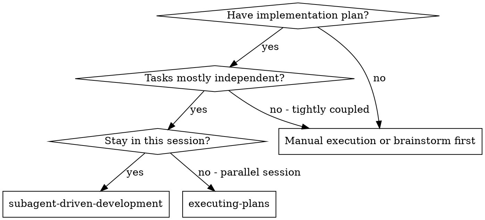
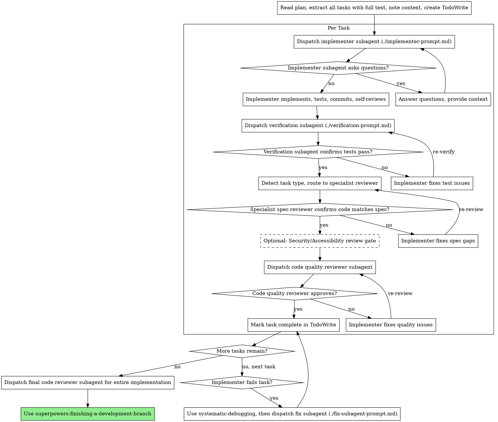

# Subagent-Driven Development

Execute plan by dispatching fresh subagent per task, with multi-stage review after each: spec compliance review (domain-specialist), then independent test verification, then code quality review.

**Core principle:** Fresh subagent per task + domain-specialist reviews + independent verification = high quality, fast iteration

## When to Use



**vs. Executing Plans (parallel session):**
- Same session (no context switch)
- Fresh subagent per task (no context pollution)
- Domain-specialist reviewers (not generic)
- Independent test verification (not self-reported)
- Systematic failure recovery (root cause analysis)
- Faster iteration (no human-in-loop between tasks)

## The Enhanced Process



## Prompt Templates

**Core templates:**
- `./implementer-prompt.md` - Dispatch implementer subagent
- `./spec-reviewer-prompt.md` - Generic spec compliance reviewer (fallback)
- `./code-quality-reviewer-prompt.md` - Code quality reviewer

**Enhanced templates:**
- `./fix-subagent-prompt.md` - Fix failed implementation (NEW)
- `./verification-prompt.md` - Independent test verification (NEW)

**Reference:**
- `./references/specialist-routing.md` - Domain-specialist routing guide (NEW)

## Domain-Specialist Routing

Before dispatching spec compliance reviewers, analyze task description for keywords:

| Keywords | Domain | Specialist Agent |
|----------|--------|------------------|
| API, endpoint, route, backend, database, schema | Backend | `backend-development:backend-architect` |
| Component, UI, frontend, React, accessibility | Frontend | `frontend-mobile-development:frontend-developer` |
| Infrastructure, CI/CD, Docker, Kubernetes | DevOps | `senior-devops` |
| Data, pipeline, ETL, analytics | Data Engineering | `senior-data-engineer` |
| ML, model, training, inference | Data Science | `senior-data-scientist` |
| Architecture, design, scalability | Architecture | `senior-architect` |

See `references/specialist-routing.md` for detailed routing instructions and prompt templates.

## Example Enhanced Workflow

```
You: I'm using Subagent-Driven Development to execute this plan.

[Read plan file once: docs/plans/feature-plan.md]
[Extract all 5 tasks with full text and context]
[Create TodoWrite with all tasks]

Task 1: Hook installation script

[Detect task type: generic utility]
[Get Task 1 text and context (already extracted)]
[Dispatch implementation subagent with full task text + context]

Implementer: "Before I begin - should the hook be installed at user or system level?"

You: "User level (~/.config/superpowers/hooks/)"

Implementer: "Got it. Implementing now..."
[Later] Implementer:
  - Implemented install-hook command
  - Added tests, 5/5 passing
  - Self-review: Found I missed --force flag, added it
  - Committed

[Dispatch verification subagent]
Verifier: Command: npm test -- --testPathPattern=hook
         Output: PASS 5/5 tests
         ✅ Claim confirmed

[Dispatch generic spec compliance reviewer - task type unclear]
Spec reviewer: ✅ Spec compliant - all requirements met, nothing extra

[Get git SHAs, dispatch code quality reviewer]
Code reviewer: Strengths: Good test coverage, clean. Issues: None. Approved.

[Mark Task 1 complete]

Task 2: Add user authentication API endpoint

[Detect task type: Backend - keywords: API, endpoint, auth]
[Dispatch implementation subagent]

Implementer: [No questions, proceeds]
Implementer:
  - Implemented POST /api/auth/login endpoint
  - Added JWT token generation
  - Tests: 12/12 passing
  - Committed

[Dispatch verification subagent]
Verifier: ✅ Claim confirmed - 12/12 tests passing

[Dispatch backend-development:backend-architect for spec review]
Backend specialist: ✅ Spec compliant
  Notes: Good RESTful design, appropriate status codes,
         but see code quality review for security concerns

[Optional: Add security review gate for auth task]
Security reviewer: Issues (Important):
  - Password not hashed before comparison
  - No rate limiting on login endpoint
  - Missing CORS configuration

[Implementer fixes security issues]
Implementer: Added bcrypt hashing, rate limiter middleware, CORS config

[Security reviewer re-checks]
Security reviewer: ✅ Approved

[Dispatch code quality reviewer]
Code reviewer: Strengths: Clean, well-tested. Issues: None. Approved.

[Mark Task 2 complete]

...

[After all tasks]
[Dispatch final code-reviewer]
Final reviewer: All requirements met, ready to merge

Done!
```

## Enhanced Features

### 1. Independent Test Verification

Before accepting implementer's test report, dispatch verification subagent:

**Why:** Implementers may be mistaken, optimistic, or run tests incorrectly.

**Template:** Use `./verification-prompt.md`

**Integration:** After implementer reports test results, before spec review.

### 2. Domain-Specialist Spec Review

Route spec compliance reviews to domain specialists based on task keywords.

**Why:** Generic reviewers miss domain-specific concerns (API design patterns, accessibility, infrastructure).

**Template:** See `references/specialist-routing.md`

**Fallback:** Use generic `./spec-reviewer-prompt.md` for tasks without clear domain.

### 3. Optional Third Review Gate

For certain task types, add optional third review:

- **Security review** for auth/API/sensitive-data tasks
- **Accessibility review** for UI/frontend tasks

**Why:** Catch domain-specific security and accessibility issues before they ship.

### 4. Systematic Failure Recovery

When implementer fails a task:

1. Use `systematic-debugging` skill to investigate root cause
2. Dispatch fix subagent using `./fix-subagent-prompt.md`
3. Re-run review gates

**Why:** "Dispatch fix subagent" was referenced but had no template. Now systematic.

## Advantages

**vs. Manual execution:**
- Subagents follow TDD naturally
- Fresh context per task (no confusion)
- Parallel-safe (subagents don't interfere)
- Subagent can ask questions (before AND during work)

**vs. Executing Plans:**
- Same session (no handoff)
- Continuous progress (no waiting)
- Domain-specialist reviews (not generic)
- Independent verification (not self-reported)
- Systematic failure recovery

**Quality gates:**
- Self-review catches issues before handoff
- Independent test verification (evidence before assertions)
- Domain-specialist spec review (relevant expertise)
- Optional security/accessibility reviews
- Code quality ensures implementation is well-built

**Cost:**
- More subagent invocations per task
- Controller does more prep work
- But catches issues earlier (cheaper than debugging later)

## Red Flags

**Never:**
- Skip reviews (verification, spec compliance, OR code quality)
- Proceed with unfixed issues
- Dispatch multiple implementation subagents in parallel (conflicts)
- Make subagent read plan file (provide full text instead)
- Skip scene-setting context (subagent needs to understand where task fits)
- Ignore subagent questions (answer before letting them proceed)
- Accept "close enough" on spec compliance (issues found = not done)
- Skip review loops (issues found = fix = re-review)
- Let implementer self-report replace independent verification
- Start code quality review before spec compliance is ✅
- Move to next task while any review has open issues
- Accept implementer's test report without verification

**If subagent asks questions:**
- Answer clearly and completely
- Provide additional context if needed
- Don't rush them into implementation

**If reviewer finds issues:**
- Implementer (same subagent) fixes them
- Reviewer reviews again
- Repeat until approved
- Don't skip the re-review

**If implementer fails task:**
1. Use `systematic-debugging` to investigate root cause
2. Dispatch fix subagent using `./fix-subagent-prompt.md`
3. Don't try to fix manually (context pollution)

## Integration

**Required workflow skills:**
- **superpowers:writing-plans** - Creates the plan this skill executes
- **superpowers:requesting-code-review** - Code review template for reviewer subagents
- **superpowers:finishing-a-development-branch** - Complete development after all tasks
- **systematic-debugging** - Root cause investigation for failed tasks (NEW)

**Subagents should use:**
- **superpowers:test-driven-development** - Subagents follow TDD for each task

**Alternative workflow:**
- **superpowers:executing-plans** - Use for parallel session instead of same-session execution

**Optional integrations:**
- **horde-review** - Pre-execution plan quality check
- **accessibility-auditor** - Third review gate for UI tasks
- Domain specialist agents - See `references/specialist-routing.md`
